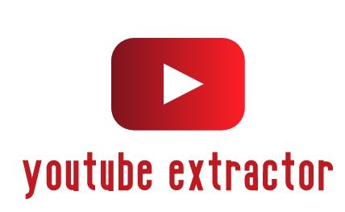

# YouTube Extractor

    
     A Simple and Easy to use GUI based YouTube Video/Audio Extractor.

---

 

## Table of Contents

- [Motivation](#Motivation)
- [Installation](Installation)
- [Usage](#Usage)
- [Contributing](#Contributing)
- [License](#License)

## Motivation

We all have tried downloading a YouTube video atleast once in our lives. Be it a song or a video for your school/college assignment.  
True, there are plenty of browser extensions and online websites avilable to download YouTube videos. But, at times either the extension malfunctions or the servers don't work anymore. 

And hence YouTube-Extractor was made. You can launch it any time and download any video/audio on YouTube.

## Installation

For the latest stable version, head to [Releases](https://github.com/SVijayB/YouTube-Extractor/releases)

Download and extract the source code.

As an alternative, you could also clone the repository using,

<pre>
git clone https://github.com/SVijayB/YouTube-Extractor.git
</pre>

Before running the YouTube-Extractor, make sure you have pytube3 installed. To do this, type the following code in your terminal.

<pre>
python -m pip install pytube3==10.4.1
</pre>

As an alternative you can also cd to YouTube-Extractor directory and type 

<pre>
pip install -r requirements.txt
</pre>

To check if pytube3 is successfully installed on your computer, open your terminal and type `pytube3 --version`
Once you have pytube3 installed, just run the `YouTube Extractor.py` file present in the `src` folder.

**Note** : Typing-Speed-Test uses custom fonts. Most windows computers have them preinstalled. However, if you don't have them already, just open the `Fonts` folder present in assets and launch all the files present and hit on install.

## Usage

Once you have the fonts and pytube3 installed. Just open the src folder and launch the `Youtube Extractor.py` file. 

**Note** : In order to download an entire playlist at once, just copy the first video from the playlist -> index = 1, and select the playlist checkbox.

## Contributing 

To contribute to YouTube Extractor, fork the repository, create a new branch and send us a pull request. Make sure you read [CONTRIBUTING.md](https://github.com/SVijayB/YouTube-Extractor/blob/master/.github/CONTRIBUTING.md) before sending us Pull requests. 

Also, thanks for contributing to Open-source!

## License 

YouTube Extractor is under The MIT License. Read the [LICENSE](https://github.com/SVijayB/YouTube-Extractor/blob/master/LICENSE) file for more information.
